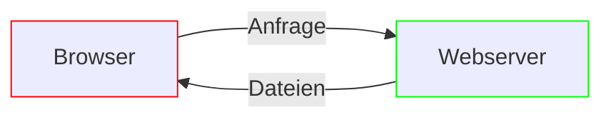

import Lead from '@components/Lead.astro'
import PageTitle from '@components/PageTitle.astro'
import CardGrid from '@components/CardGrid.astro'
import LinkCard from '@components/LinkCard.astro'

<PageTitle text='Entwicklung' />

<Lead text={frontmatter.description} />

## Was gehört zu einer Entwicklungsumgebung?

Um eine Website zu entwickeln, benötigst du neben einem Texteditor, auch <abbr title="Integrated Development Environment">IDE</abbr> genannt, folgende Dinge:

- **Node.js** zur Ausführung von Tools wie dem [Website-Starterkit](/starterkit/einfuehrung)
- **Paketmanager** wie <abbr title="Node Paketmanager">npm</abbr> zur Installation und Verwaltung von Tools
- **Webserver** zur Bereitstellung deiner Website im Browser

Folgendes Diagramm zeigt, warum ein Webserver notwendig ist:

Wenn du eine Webseite in deinem Browser aufrufst, sendet dieser eine Anfrage an einen **Webserver** (meist Apache oder Nginx). Der Webserver antwortet mit den Dateien, die für die Webseite benötigt werden (HTML, CSS, JavaScript, Bilder usw.). Der Browser interpretiert diese Daten und stellt das Resultat dar.

Ein solcher Webserver ist auch im [Website-Starterkit](/starterkit/einfuehrung) enthalten.

## IDE

Editoren werden meist IDE[^2] genannt. Sie erleichtern dir das Schreiben von HTML, CSS und JavaScript und anderen Sprachen. Im Seminar GT 1191 haben wir eine vorkonfigurierte Version von Visual Studio Code genutzt.

[Visual Studio Code](https://code.visualstudio.com/)
: Kostenlose IDE von Microsoft.

[VS Code Profile](https://gist.github.com/macx/c4afc6441561cf8e021d104eed0de505)
: Vorkonfigurierte Einstellungen für Visual Studio Code.

[Emmet Cheat Sheet](https://docs.emmet.io/cheat-sheet/)
: Auflistung aller Kurzbefehle, um komplexes Markus schreiben zu können.

Lass uns nun Node.js und einen Paketmanager installieren. Dazu brauchst du drei Dinge: das Terminal, in dem du Befehle ausführst, Node.js samt Paketmanager zur Installation deiner Tools, und Git zur Versionierung deiner Projekte.

<CardGrid>
  <LinkCard title="Terminal" href="/dokumentation/entwicklung/terminal" />
  <LinkCard
    title="Node.js und Paketmanager"
    href="/dokumentation/entwicklung/nodejs"
  />
  <LinkCard title="Git" href="/dokumentation/entwicklung/git" />
</CardGrid>

## Werkzeuge

[Can I use](https://caniuse.com/)
: Zeigt an, welcher Browser welches Front-end-Feature unterstützt.

[Can I email](https://www.caniemail.com/)
: Das Selbe wie „Can I use“, nur für E-Mails.

[Chrome DevTools](https://developer.chrome.com/docs/devtools/overview/)
: Zur allgemeinen Bedienung über die Verwendung spezifischer Informationen.

[Dear Console&#x202f;…](https://codepo8.github.io/dearconsole/)
: Sammlung von kleinen Scripts für die DevTools-Konsole.

[Browserslist](https://browsersl.ist/)
: Browserkompatibilitätskonfiguration für beliebte JavaScript-Tools wie Autoprefixer, Babel, ESLint, PostCSS und Webpack. Interessant ist auch die [Checkliste](https://browserslist.dev/).

## Umgebungen

[Website-Starterkit](/starterkit/einfuehrung)
: Vorkonfiguriertes Parcel, der prefekte Start für deine erste Website.

[Astro](https://astro.build/)
: Bevorzugtes Web-Framework, bei denen der Inhalt im Vordergrund steht.

[Laravel Herd](https://herd.laravel.com/)
: Einfache PHP-Entwicklungsumgebung für Mac und Windows, um PHP und Nginx bereitzustellen.

[^2]: IDE steht für Integrated Development Environment. Ein Editor, der speziell für die Entwicklung von Software und Webseiten konzipiert ist.
